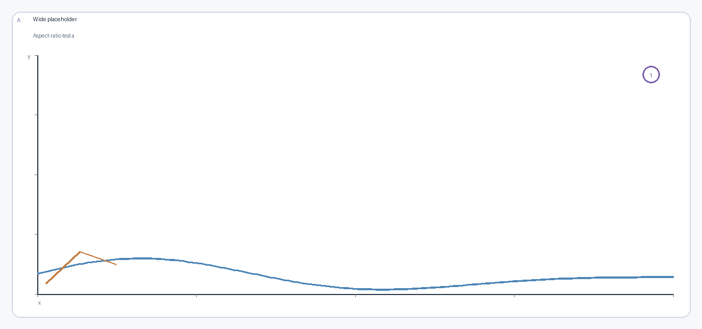
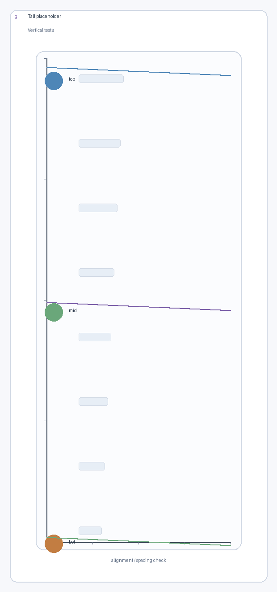
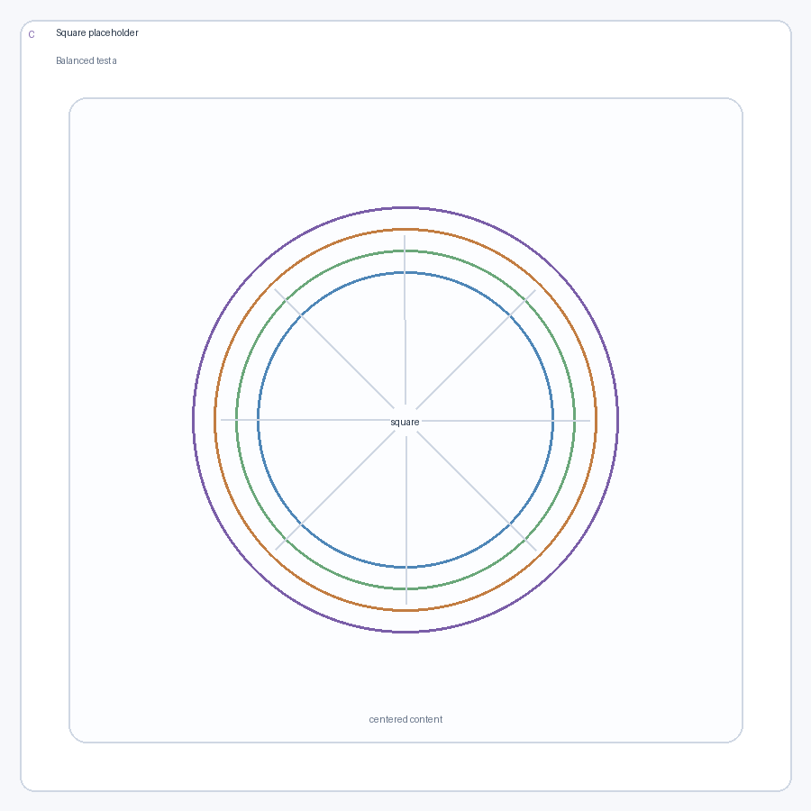
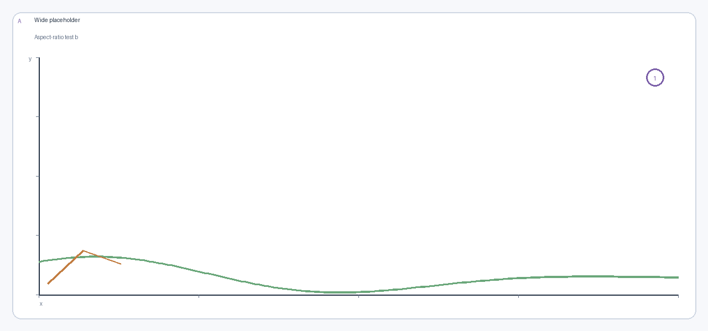
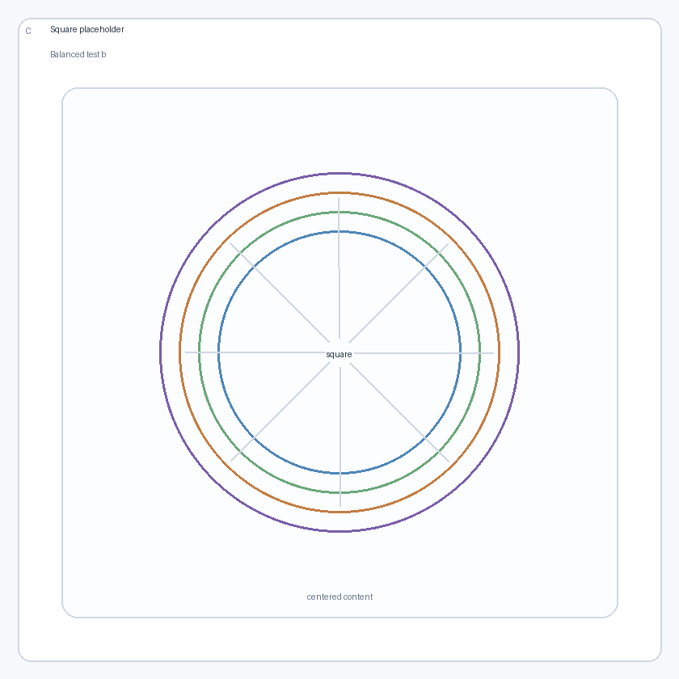
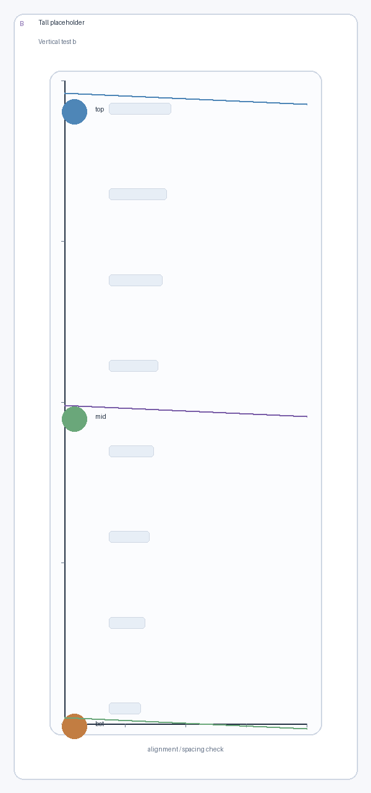

<!-- _class: title-slide -->

# NJU Unofficial Template


Minimal academic slides for Marp

Self-documenting demo deck

PDF-first and intentionally unofficial

::: footer
April 25, 2026 --- Nanjing, China
:::

---

# What this theme gives you

- One layout directive per slide: `single`, `cols`, or `grid`.
- Structured containers: `col`, `caption`, `ref`, `top`, `bottom`, `footer`.
- Compact math via MathJax, clean code blocks, and a quiet color palette.
- PDF-first output with no build dependencies beyond Node.js and Marp CLI.

::: footer
Start from this file, then delete the example slides you do not need.
:::

---

# Quick-start syntax

Use one layout directive, then compose the slide from `col`, `caption`, `ref`, `top`, `bottom`, and `footer`.

```markdown
<!-- _layout: cols 1 1 -->

# Two-panel figure

::: col


::: caption
Left message.
:::

::: ref
Left ref.
:::

:::

::: col

:::

::: footer
Slide-level note.
:::
```

::: footer
Supported directives: `single`, `cols ...`, and `grid RxC`.
:::

---

<!-- _layout: single -->

# Single layout example

::: col


::: caption
`single` centers one panel and keeps the main message directly under it.
:::

::: ref
Good default for one key figure, one claim, and one short source line.
:::
:::

::: footer
Syntax: `<!-- _layout: single -->`
:::

---

<!-- _layout: cols 1 1 -->

# Two-column example

::: col


::: caption
Use the left panel for setup or comparison A.
:::

::: ref
Per-panel refs can stay attached to the panel.
:::
:::

::: col


::: caption
Use the right panel for comparison B.
:::

::: ref
The bottom footer remains shared across the whole slide.
:::
:::

::: footer
Syntax: `<!-- _layout: cols 1 1 -->`
:::

---

<!-- _layout: cols 5 4 -->
<!-- _valign: start -->

# Figure and text in one row

::: col


::: caption
Left: the main panel.
:::

::: ref
Per-panel ref stays attached to the panel.
:::

:::

::: col
- The opposite column can be normal Markdown text.
- Bullets stay at the same base size as a normal text slide.
- This is the common "figure plus discussion" pattern.

:::

::: footer
Syntax: `<!-- _layout: cols 5 4 -->` with `<!-- _valign: start -->`.
:::

---

<!-- _layout: cols 4 5 -->

# Top and bottom around columns

::: top
Top text can introduce the slide before the columns.
:::

::: col
- Text can stay on the left.
- Reading order remains simple.
- This works for setup bullets.

:::

::: col


::: caption
Right: a panel with a caption.
:::

:::

::: bottom
Bottom text can summarize the slide after the columns.
:::

::: footer
Supports `top` above the body and `bottom` below it.
:::

---

<!-- _layout: cols 1 1 -->
<!-- _caption_align: right -->

# Caption alignment control

::: col


::: caption
This caption follows the slide default and aligns right.
:::

:::

::: col


::: caption left
This caption overrides the slide default and aligns left.
:::

:::

::: footer
Use `::: caption left` or `::: caption right`; slide default: `<!-- _caption_align: ... -->`.
:::

---

<!-- _layout: cols 1 1 1 -->

# Three-column example

::: col


::: caption
Three equal columns work well for compact comparisons.
:::

:::

::: col


::: caption
Keep each message to one short line.
:::

:::

::: col


::: caption
`cols` accepts any positive numeric sequence.
:::

:::

::: footer
Syntax: `<!-- _layout: cols 1 1 1 -->`
:::

---

<!-- _layout: grid 2x2 -->

# 2x2 grid example

::: col


::: caption
Panel 1
:::

:::

::: col


::: caption
Panel 2
:::

:::

::: col


::: caption
Panel 3
:::

:::

::: col


::: caption
Panel 4
:::

:::

::: footer
Syntax: `<!-- _layout: grid 2x2 -->`
:::

---

<!-- _layout: grid 2x3 -->

# Grid spanning: merged rectangle

::: col 1-2,1-2


::: caption
Spanning rows 1–2, cols 1–2
:::

:::

::: col 1,3


::: caption
Row 1, col 3
:::

:::

::: col 2,3


::: caption
Row 2, col 3
:::

:::

::: footer
Syntax: `::: col 1-2,1-2` places a panel at rows 1–2, cols 1–2.
:::

---

<!-- _layout: grid 2x2 -->

# Grid spanning: tall left panel

::: col 1-2,1


::: caption
Spans both rows in col 1
:::

:::

::: col 1,2


::: caption
Top-right cell
:::

:::

::: col 2,2


::: caption
Bottom-right cell
:::

:::

::: footer
Equivalent of the old `merge-left` class, but general and explicit.
:::

---

<!-- _layout: cols 1 1 -->

# Shared caption and reference below columns

::: col


::: caption
Panel A
:::

:::

::: col


::: caption
Panel B
:::

:::

::: caption
Top-level `caption` spans the full width below the columns.
:::

::: ref
Top-level `ref` also spans the full width and is useful for shared provenance.
:::

::: footer
`caption`, `ref`, and `footer` have distinct jobs and should not be mixed.
:::

---

# Code block styling

The theme keeps code readable and quiet. The command block below matches the intended author workflow.

```sh
npm install
npm test
npm run html
npm run pdf
```

::: footer
Run these commands from the template root to build slides.
:::

---

# LaTeX and equations

Enable MathJax in front matter, then mix inline math like $E = mc^2$ with displayed equations:

$$
\chi(q,\omega) = \frac{\chi_0(q,\omega)}{1 - U \chi_0(q,\omega)}
$$

$$
\begin{pmatrix}
1 & t \\
t & 1
\end{pmatrix}
\qquad
\begin{aligned}
F(T) &= E - TS \\
C_V &= -T \frac{\partial^2 F}{\partial T^2}
\end{aligned}
$$

::: footer
Math snippet: `slides/snippets/latex-example.md`
:::

---

<!-- _layout: cols 1 1 -->
<!-- _valign: start -->

# Acknowledgements

::: col

**University of Catburg**
E. Schr&ouml;dinger, F. Whiskers, G. Pawlov

**Institute for Uncertain Sciences**
W. Heisenberg, U. Blurry, V. Fuzzystate

**Royal College of Antimatter**
P. Dirac, Q. Spinor, R. Bra-Ket

:::

::: col

**Funding**
Quantum Cat Foundation
Ministry of Entangled Affairs

:::

::: bottom
<div class="big-center">Thank you</div>
:::

::: footer
April 25, 2026 --- Nanjing, China
:::
